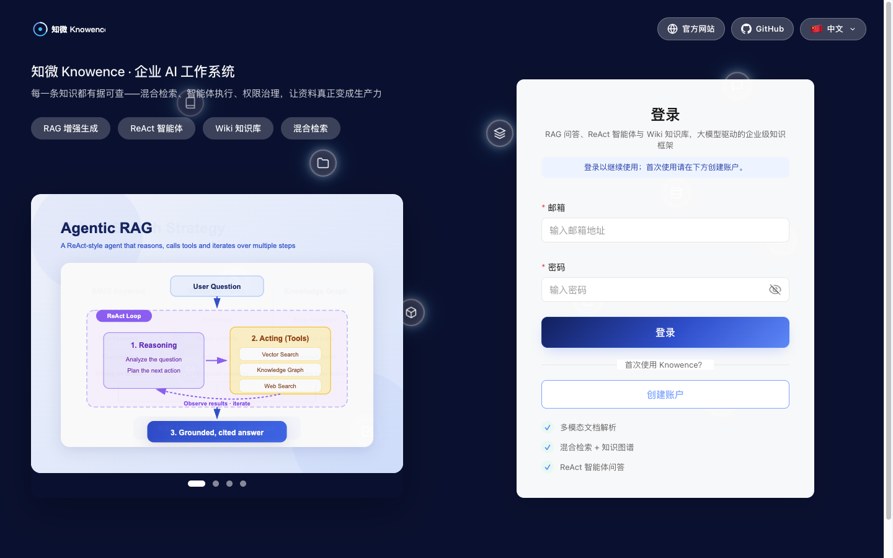
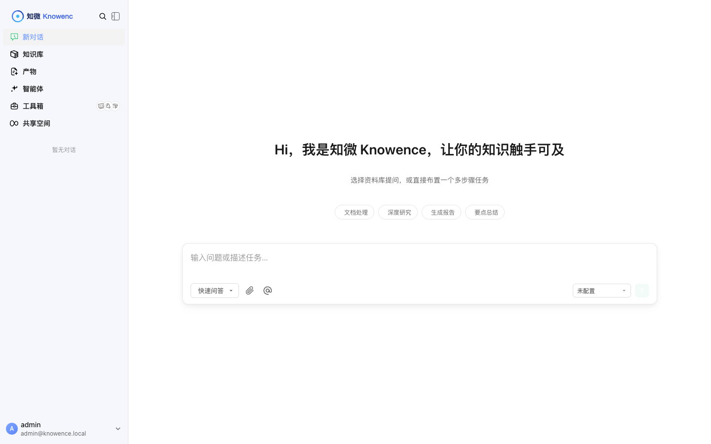
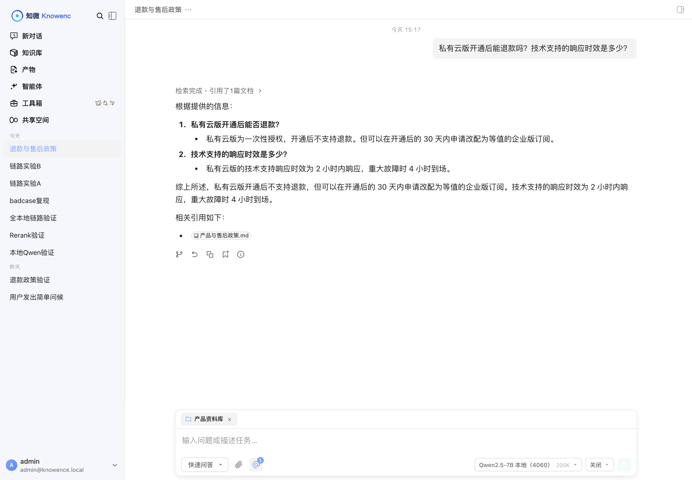

# 知微 Knowence · 企业 AI 工作系统

> **把企业资料变成可追溯的答案、可执行的任务、可审计的操作。**
>
> 面向受数据合规约束、不能让资料出内网的企业：检索、重排、向量化、生成**四个环节全部可本地化**，
> AI 能力按角色分级开放，敏感动作需人工审批，全程留痕。







> 上图底部模型选择器显示 **Qwen2.5-7B 本地（4060）**——检索、重排、向量化、生成四个环节全部本地完成。
> 答案中的每条事实都挂着可点开的原文出处。

---

## 目录

- [它解决什么问题](#它解决什么问题)
- [核心能力](#核心能力)
- [系统架构](#系统架构)
- [实测验证](#实测验证)　← 有真实数据，非设计稿
- [快速开始](#快速开始)
- [本项目的改造范围](#本项目的改造范围)　← 区分上游能力与本项目实现
- [关键决策](#关键决策)
- [文档索引](#文档索引)
- [目录结构](#目录结构)

---

## 它解决什么问题

企业里三类典型困境：

| 困境 | 具体表现 | 知微的做法 |
| --- | --- | --- |
| **资料找不到、答不准** | 政策散在网盘和聊天记录里，新人反复问老问题 | 统一知识库 + 混合检索 + 重排，答案**每条事实都挂原文出处** |
| **不敢上公网大模型** | 资料含个人信息/合同，合规不允许出内网 | 检索/重排/向量化/生成**全链路可本地部署**，实测内网闭环 |
| **AI 权限一刀切** | 要么全员可用（越权风险），要么全禁用（无价值） | 四级角色 + 业务域知识库隔离 + **高风险操作人工审批** + 全量审计 |

---

## 核心能力

- **统一 RAG 知识库** —— Word / PDF / Excel / Markdown 等多格式入库；分块可编辑、可比对、可回滚
- **有据可查的回答** —— 查询理解 → 多路并发召回（向量 + 关键词混合）→ **Rerank 重排** → Top-K 截断 → 引用回填 → 生成
- **Agent 任务执行** —— ReAct 循环 + 工具调用（数据分析 / 数据库查询 / 浏览器 / 沙箱脚本），**敏感动作挂起等人工确认**
- **权限治理** —— 四级角色（owner / admin / contributor / viewer）、业务域知识库隔离、API-Key 默认拒绝、62 类事件审计
- **模型自由** —— 对话 / Embedding / Rerank **三类模型独立配置**，OpenAI 兼容协议，云端与本地一键切换
- **多渠道分发** —— Web 端；企微 / 飞书 / 钉钉等 IM 适配器；内置 MCP Server

---

## 系统架构

### 分层设计

```
┌─────────────────────────────────────────────────────┐
│  多渠道分发层    Web · IM 适配器 · MCP Server         │
├─────────────────────────────────────────────────────┤
│  权限治理层      四级 RBAC · 知识库隔离 · 审批 · 审计  │
├─────────────────────────────────────────────────────┤
│  Agent Harness   工具注册调度 · 会话上下文 · 审批拦截  │
├─────────────────────────────────────────────────────┤
│  RAG 引擎        查询理解 → 多路召回 → Rerank →       │
│                  引用回填 → 生成                     │
├─────────────────────────────────────────────────────┤
│  业务资产层      知识库 · 分块版本 · 数据源同步        │
├─────────────────────────────────────────────────────┤
│  模型基座层      chat · embedding · rerank           │
│                  （云端 API 与本地部署同接口）         │
└─────────────────────────────────────────────────────┘
```

**分层的目的是让每层可独立替换**：模型基座从云端切到本地，上层业务代码零改动——本项目实际做过这个动作。

### 部署形态：平台节点 + 推理节点分离

```
        Mac（平台节点）                        Windows（推理节点）
┌──────────────────────────────┐      ┌──────────────────────────┐
│  ① 混合检索                   │      │  RTX 4060 8GB            │
│     向量(pgvector) + BM25     │      │  Qwen2.5-7B-Instruct     │
│  ② Rerank 重排                │      │  Q4_K_M · 100% GPU       │
│      bge-reranker-v2-m3      │─────►│  实测 48.9 tok/s          │
│  ③ 本地向量化 bge-m3（1024维）│ 局域网│                          │
│  ④ 引用回填 + 审计            │◄─────│  生成答案 + 引用标记      │
└──────────────────────────────┘      └──────────────────────────┘
            文档内容全程不出内网
```

**为什么分离**：推理吃 GPU、平台吃 IO 与存储，职责不同、可独立扩容。这同时贴近企业真实部署形态。

---

## 实测验证

> 以下全部为**本机实测结果**，复现步骤见 [本地部署实录](docs/阶段文档/本地部署实录.md)。

### 模型层

| 环节 | 模型 | 实测结果 |
| --- | --- | --- |
| 向量化 | bge-m3-FP16（本地） | ✅ `dimension:1024, elapsed:543ms` |
| **重排** | bge-reranker-v2-m3-FP16（本地） | ✅ 3 候选 243ms；**相关文档 6.67 分，无关 -7.2 分** |
| **对话生成** | Qwen2.5-7B Q4_K_M（本地 GPU） | ✅ **48.9 tok/s**，显存 5426/8188 MiB，GPU 利用率 100% |

### 检索与生成链路

| 验证项 | 方法 | 结果 |
| --- | --- | --- |
| 文档入库 | 上传政策文档 | ✅ 3 个分块，completed / enabled |
| 混合检索 | 查询"私有云版可以退款吗" | ✅ 命中退款政策分块 |
| 重排生效 | 重排服务调用计数 | ✅ 候选 3 → 重排 3 |
| 引用溯源 | 检查答案标记 | ✅ 携带 `<kb doc="…" chunk_id="…" kb_id="…">` |
| **端到端** | 单次问答计时 | ✅ **8.8 秒**（含检索+重排+生成） |

### 端到端问答实例

**问**：私有云版开通后能退款吗？技术支持的响应时效是多少？

**答**（由本地 Qwen2.5-7B 生成）：

> 私有云版开通后不支持退款。技术支持的响应时效如下：
> - **社区版**：无 SLA，社区互助
> - **企业版**：工作日 4 小时内响应，服务时间 9:00-18:00
> - **私有云版**：2 小时内响应，重大故障 4 小时内到场，服务时间 7×24 小时

答案同时携带可点开的原文出处标记。

### 效果评测（自建评测集）

平台自带评测框架，但**框架自带数据集只有 1 条 QA**，无法区分配置优劣。因此自建评测集：
**20 段落政策语料 + 32 道题**（含主题相邻的干扰段落），含相关性标注与参考答案。
详见 [评测报告](docs/evidence/评测报告.md)。

| 指标 | 重排（默认阈值 0.3） | 无重排 | **重排（阈值 -10）** |
| --- | --- | --- | --- |
| precision / recall / ndcg / mrr / map | 0.9688 | 1.0000 | **1.0000** |
| rouge-1 | 0.4281 | 0.4897 | **0.5070** |
| rouge-L | 0.4043 | 0.4664 | **0.4880** |

**评测中发现并修复了一个真实配置缺陷**：重排模型 `bge-reranker-v2-m3` 输出的是
**原始 logits（约 -10~+10）**，而默认阈值 `0.3` 是按 0~1 归一化分数设的——
21 个候选被过滤到只剩 1 条，一旦 top-1 不是标注答案该题就彻底丢分。
放宽阈值后检索回满分，**生成指标提升 18.4%**。

> 关键做法：**指标下降时没有直接接受结论**，而是回去看重排的实际打分
> （正确段落 6.61、无关段落 -0.91，区分度极好），从而定位到是阈值而非模型的问题。

### 关键结论

**检索、重排、向量化、生成四个环节全部在内网完成**——"数据不出域"从设计声明变为可验证事实。

---

## 快速开始

### 前置

- Docker（平台节点）
- 可选：一台带独显的机器做推理节点（无独显可只用云端 API）

### 一键部署（推荐）

```bash
git clone <本仓库地址> knowence && cd knowence

cp .env.example .env
# 改掉 .env 里的三个必改项：DB_PASSWORD / JWT_SECRET / SYSTEM_AES_KEY

./scripts/download-models.sh    # 下载本地模型（约 2.2GB，走 ModelScope 国内快源）
docker compose up -d

# 打开 http://localhost:8081
```

**只想起平台、不跑本地模型**：把 `docker-compose.yml` 里的 `embed` / `rerank` 注释掉，
改用云端 API（在平台设置里配 embedding 与 rerank 模型）。

**首次启动要等一会儿**：数据库迁移 + 模型加载（重排模型约 45 秒）。
用 `docker compose ps` 看健康状态。

### 手动部署（想了解每个组件在做什么）

<details>
<summary>展开：五个容器的 docker run 命令</summary>

```bash
docker network create knowence-net

# 1. 检索库（PostgreSQL + pgvector + BM25）
docker run -d --name knowence-db --network knowence-net --network-alias postgres \
  -e POSTGRES_PASSWORD=<你的密码> -e POSTGRES_DB=WeKnora \
  -v knowence-pgdata:/var/lib/postgresql/data paradedb/paradedb:v0.22.6-pg17

# 2. 本地向量服务（⚠️ 模型必须放 Docker 原生卷，见部署实录坑 7）
docker run -d --name knowence-embed --network knowence-net --network-alias embed \
  -v knowence-models:/models:ro ghcr.nju.edu.cn/ggml-org/llama.cpp:server \
  -m /models/bge-m3-FP16.gguf --embedding --pooling cls -c 8192 -t 8

# 3. 本地重排服务（⚠️ 阈值要设 -10，见部署实录坑 11）
docker run -d --name knowence-rerank --network knowence-net --network-alias rerank \
  -v knowence-models:/models:ro ghcr.nju.edu.cn/ggml-org/llama.cpp:server \
  -m /models/bge-reranker-v2-m3-FP16.gguf --rerank -c 2048 -t 8

# 4. 后端
docker run -d --name knowence-app --network knowence-net --network-alias app -p 18080:8080 \
  -e DB_DRIVER=postgres -e DB_HOST=postgres -e DB_NAME=WeKnora \
  -e AUTO_MIGRATE=true -e RETRIEVE_DRIVER=postgres \
  -e SSRF_WHITELIST_EXTRA=embed,rerank,<推理节点IP> \
  -v knowence-data:/app/data wechatopenai/weknora-app:v0.8.2

# 5. 前端
docker run -d --name knowence-ui --network knowence-net -p 8081:80 \
  -e APP_HOST=knowence-app wechatopenai/weknora-ui:v0.8.2
```

访问 `http://localhost:8081`，注册账号 → 添加模型 → 建知识库 → 上传文档。

</details>

### 推理节点（可选，用于完全本地化）

Windows + NVIDIA 显卡见 [deploy/README-Windows推理节点.md](deploy/README-Windows推理节点.md)。

**关键三步**（少一步就连不上）：
```powershell
# 1) 监听所有网卡（默认只监听 127.0.0.1，不改永远连不上）
[Environment]::SetEnvironmentVariable('OLLAMA_HOST','0.0.0.0:11434','Machine')

# 2) 放行防火墙
New-NetFirewallRule -DisplayName "Ollama 11434" -Direction Inbound `
  -LocalPort 11434 -Protocol TCP -Action Allow -Profile Any

# 3) 模型走国内快源导入（官方仓库 ~186KB/s，ModelScope 实测 ~27MB/s）
#    详见 deploy/README-Windows推理节点.md
```

### 两个必知的部署约束

1. **向量模型必须在灌入第一份文档前定死**——之后更换会导致整个索引不可用
2. **重排模型要配在 Agent 上而不是租户级**——问答路径不读租户级配置（见部署实录坑 10）

---

## 本项目的改造范围

> 本项目基于 [Tencent/WeKnora](https://github.com/Tencent/WeKnora)（MIT）二次开发。
> **为免误解，明确区分上游能力与本项目实现。**

| 能力 | 来源 | 状态 |
| --- | --- | --- |
| RAG 管线、混合检索、RBAC、审计、IM 适配器、MCP | WeKnora 上游 | 代码可用；除检索链路外未逐一验证 |
| **本地模型部署方案**（向量/重排/对话全本地） | 本项目 | ✅ 已实测，含性能数据 |
| **推理节点与平台节点分离部署** | 本项目 | ✅ 已实测 |
| **品牌体系与工作台改造** | 本项目 | ✅ 已构建验证，品牌残留 0 |
| **部署踩坑与排障记录**（10 个实证问题） | 本项目 | ✅ 见部署实录 |
| 产品需求与决策台账 | 本项目 | 见 PRD |

**改造方式**：品牌层以独立文件叠加（`knowence-brand.css`、`KnowenceWaves.vue`），
尽量不侵入上游逻辑，便于跟随上游升级。基线锁定见 [docs/BASE_LOCK.md](docs/BASE_LOCK.md)。

---

## 关键决策

| 决策 | 理由 |
| --- | --- |
| **选 WeKnora 而非 Dify / FastGPT / QAnything** | Dify 与 FastGPT 的许可证限制多租户/去 LOGO；QAnything 为 AGPL。WeKnora 是 MIT，商用无附加限制 |
| **换 ParadeDB 而非 SQLite** | 官方镜像的 SQLite 未编译 FTS5，混合检索的关键词那一路直接失败。要真正的"向量+关键词"混合检索，必须用专用检索组件 |
| **推理与平台分离** | macOS 上 Docker 无法透传 GPU，容器内纯 CPU 推理仅 2.0 tok/s；分离后本地模型跑到 48.9 tok/s |
| **重排模型不做量化** | 重排输出是单一相关性分数，量化对排序质量的影响比生成模型更敏感；FP16 仅 1.1GB，代价可接受 |
| **权限粒度止于知识库级** | 文档/chunk 级 ACL 需把过滤条件下推到向量检索层，否则会污染 Top-K，属重型改造，列入后续规划 |

完整决策台账（含未落地项与原因）见 [docs/PRD/PRD.md](docs/PRD/PRD.md)。

---

## 文档索引

| 文档 | 内容 |
| --- | --- |
| [docs/PRD/PRD.md](docs/PRD/PRD.md) | 产品需求：目标用户、主链路、验收标准、**决策台账** |
| [docs/阶段文档/本地部署实录.md](docs/阶段文档/本地部署实录.md) | **真实部署过程 + 10 个实证踩坑 + 端到端验证证据** |
| [docs/阶段文档/Knowence技术方案.md](docs/阶段文档/Knowence技术方案.md) | 架构拆解与改造设计 |
| [docs/阶段文档/技术适配声明.md](docs/阶段文档/技术适配声明.md) | 选型结论与偏离说明 |
| [docs/evidence/评测报告.md](docs/evidence/评测报告.md) | **RAG 效果评测：自建评测集、三组对照实验、阈值缺陷定位** |
| [docs/evidence/bad-cases.md](docs/evidence/bad-cases.md) | **Bad Case 分析与方法论：4 个真实失败案例 + 归因顺序 + 评测盲区** |
| [docs/与上游的差异.md](docs/与上游的差异.md) | **改了上游什么：5 个新增文件 + 31 个修改文件，改动面与升级流程** |
| [docs/BASE_LOCK.md](docs/BASE_LOCK.md) | 上游基线锁定与改动规则 |
| [deploy/README-Windows推理节点.md](deploy/README-Windows推理节点.md) | Windows 推理节点部署（含国内快源） |

---

## 目录结构

```
knowence/
├── README.md
├── deploy/                     推理节点部署脚本与说明
├── docs/
│   ├── PRD/                    产品需求与决策台账
│   ├── 阶段文档/                技术方案 · 技术适配声明 · 本地部署实录
│   ├── images/                 截图
│   ├── evidence/               评测报告 + 评测数据集（parquet）
│   └── 手册/                   使用手册
└── vendor/weknora/             上游基线（MIT）+ 本项目改造
    └── frontend/src/
        ├── assets/theme/knowence-brand.css      品牌令牌层
        ├── components/KnowenceWaves.vue         品牌动效组件
        └── components/css/knowence-workbench.css
```

---

## License

本项目为 [WeKnora](https://github.com/Tencent/WeKnora)（MIT）的衍生作品，改造部分同样以 MIT 发布。
上游版权与许可见 `LICENSE`。
